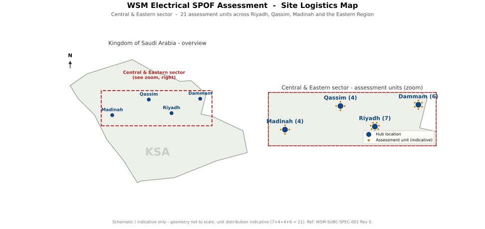

# Job Descriptions — Electrical SPOF Assessment

Role profiles for the engineering team supporting an **Electrical Single Point of Failure
(SPOF) Assessment** of **21 groundwater desalination plants** across the Central & Eastern
sector — **19 in Riyadh Province + 2 in the Eastern Province** (no plants in Madinah or
Qassim), 16 sites, ~1.66 M m³/day — over a **4-month** campaign.

| Profile | Count | File |
|---------|-------|------|
| **Project Manager (Electrical)** | 1 · BSc EE (MSc/PMP adv.) · ≥10 yrs | [project-manager-electrical.md](project-manager-electrical.md) |
| **Electrical Engineer** (plant calculation packages) | 2 · BSc EE · ≥5 yrs | [electrical-engineer.md](electrical-engineer.md) |
| **Electrical Technician** (site survey / data capture) | *optional field-support role* | [electrical-technician.md](electrical-technician.md) |

A single **combined job-description document** is also provided:
[WSM-Job-Descriptions-Combined.docx](WSM-Job-Descriptions-Combined.docx).

## Selection criteria

**Common to all roles**

- LV & MV power-system experience.
- Plant assessment experience (SPOF / reliability / condition).
- SCE (Saudi Council of Engineers) accreditation — to be discussed.
- Arabic & English.
- QHSE (ISO 9001 / 14001 / 45001) and host permit-to-work; **non-intrusive surveys only**.
- NDA and the applicable national cybersecurity data-handling requirements.

**Engineers — capability**

- **Required:** able to produce a complete **plant calculation package** autonomously —
  **load-flow, short-circuit, protection coordination, and earthing & lightning**.
- **Preferable (not required):** **arc-flash / incident-energy** study (IEEE 1584); and
  **RAM / RBD availability** analysis (IEEE 493 / ISO 20815).
- Read and red-line **single-line diagrams**; competent in failure-mode / criticality
  (FMECA) and SPOF/reliability methods.

**Reporting & key deliverables — the forms**

For each plant the team completes a set of assessment **forms**, which are the key
deliverables:

- a **document inventory**,
- a **failure-mode / criticality (FMECA)** form,
- a **recommendations register**, and
- a **site-visit report**.

Together with the **plant calculation packages** (per plant and per modification) and the
red-lined single-line diagrams / concept modification packages.

**Standards:** IEC; IEEE (including 493; 1584 preferable); NFPA 70E; ANSI; NEMA;
IEC 60812 (FMECA); ISO 20815 / ISO 14224.

## Site logistics map

The 21 plants sit at 16 sites — 19 in Riyadh Province and 2 in the Eastern Province
(Al-Hani and Hafar Al-Batin), ~1.66 M m³/day. The map below combines a national overview
with a Riyadh-province zoom in a single drawing.

*Schematic / indicative only — city-level positions, marker size ~ capacity; no plants in
Madinah or Qassim; Al-Hani (Eastern) location to verify. Rendered from `diagrams/src/build_map.py`.*

> The core team is **1 PM + 2 Electrical Engineers**; the technician profile is provided
> as an optional site-survey support role and is not part of the core team.
