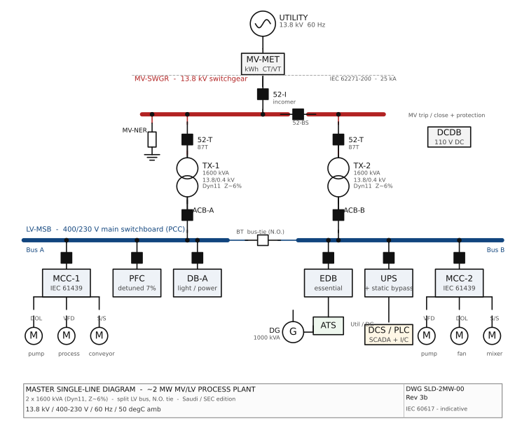

# Master Single-Line Diagram — 2 MW MV/LV Process Plant

> Complete reference SLD for the ~2 MW process plant. This is the canonical
> single-line referenced by Module 1. Tags follow the design basis in
> `docs/main-electrical-equipment-2MW-process-plant.md`.
> Concept-level; ratings indicative and to be confirmed by detailed studies.

*Figure rendered from `diagrams/src/` (schemdraw, IEC 60617). See [DRAWING-STANDARD.md](DRAWING-STANDARD.md).*

## Notes on conventions

- `[52-x]` = MV circuit breaker (ANSI 52); `[ACB]`/`[MCCB]` = LV breakers.
- `═══` busbars; `(│ │)` with `8` = transformer windings (Dyn11).
- `N.O.` = normally-open bus-tie (auto-closes on loss of one incomer).
- `M` = motor; DOL / S/S (soft-starter) / VFD denote the starter type.
- `[N]` on MV-NER = neutral point connection through the earthing resistor.

## Tag Legend

| Tag | Description |
|-----|-------------|
| MV-MET | Utility revenue metering cubicle (CTs/VTs, tariff kWh meter) at the 11 kV incomer. |
| MV-SWGR | 11 kV metal-clad switchgear: incomer CB, bus-section CB, two transformer feeders; vacuum CBs, 25 kA/1 s, IEC 62271-200. |
| MV-PROT | MV protection & control IEDs: 50/51, 50N/51N overcurrent/earth-fault, 87T transformer differential, 27/59. |
| MV-NER | Neutral Earthing Resistor — limits MV earth-fault current (~300–400 A) with neutral CT. |
| TX-1 | MV/LV power transformer No.1 — 1600 kVA, 11 kV/0.4 kV, Dyn11, Z≈6%, IEC 60076. Feeds LV-MSB Bus A. |
| TX-2 | MV/LV power transformer No.2 — 1600 kVA, 11 kV/0.4 kV, Dyn11, Z≈6%, IEC 60076. Feeds LV-MSB Bus B. |
| LV-MSB | Main LV switchboard / Power Control Centre — 400 V, split bus A/B, 2500–3200 A, 50–65 kA, ACB incomers + motorized N.O. bus-tie, IEC 61439-1/2. |
| BT | LV bus-tie circuit breaker — normally-open; auto-closes on loss of either incomer to maintain supply to the surviving bus. |
| MCC-1 | Motor Control Centre No.1 (on Bus A) — DOL / star-delta / soft-starter / VFD buckets, IEC 61439-1/2. |
| MCC-2 | Motor Control Centre No.2 (on Bus B) — DOL / soft-starter / VFD buckets, IEC 61439-1/2. |
| VFD | Variable Frequency Drive(s) for speed-controlled pumps/fans/mixers; input chokes/EMC filters, IEC 61800. |
| PFC | Power factor correction — automatic, detuned (7%) capacitor bank; corrects ~0.85 → 0.95+, IEC 60831. |
| DB / DB-A | Distribution board — lighting, small power, HVAC, sockets; MCB/RCBO. |
| EDB | Essential / emergency distribution board — fed via ATS from DG. |
| DG | Diesel generator set — sized for essential loads (~1000 kVA); AVR, day-tank, acoustic canopy. |
| ATS | Automatic Transfer Switch — Utility ↔ DG changeover for the essential bus. |
| UPS | Uninterruptible Power Supply for DCS/PLC/SCADA & instrumentation; static bypass, battery autonomy 15–30 min. |
| DCDB | DC battery & charger system — 110 V DC supply for MV switchgear trip/close & protection. |

---

*Concept-level reference SLD. Final ratings, redundancy, earthing and voltage
levels to be confirmed against the load list, short-circuit/load-flow studies,
utility connection agreement and governing standards.*
