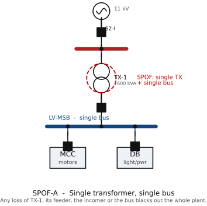

# SPOF Example A — Single Transformer, Single LV Bus

> Module 3 illustration. Tags per `docs/main-electrical-equipment-2MW-process-plant.md`
> and the master SLD `diagrams/sld-master-2MW.md`.

*Figure rendered from `diagrams/src/` (schemdraw, IEC 60617). See [DRAWING-STANDARD.md](../DRAWING-STANDARD.md).*

**What this illustrates:** A single transformer (TX-1) and a single, un-split
LV bus (LV-MSB) form an obvious SPOF — loss of the transformer, its MV feeder,
the LV incomer or any bus fault de-energises the **entire** plant. There is no
alternative path and no segregation to limit the affected zone.
