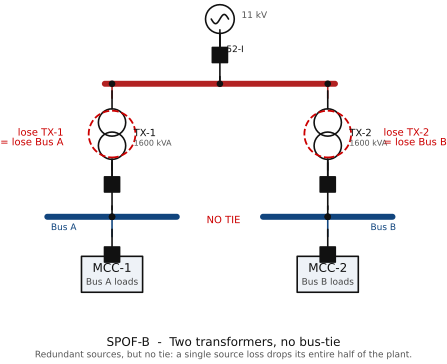

# SPOF Example B — Two Transformers, Two Buses, NO Bus-Tie

> Module 3 illustration. Tags per `docs/main-electrical-equipment-2MW-process-plant.md`
> and the master SLD `diagrams/sld-master-2MW.md`.

*Figure rendered from `diagrams/src/` (schemdraw, IEC 60617). See [DRAWING-STANDARD.md](../DRAWING-STANDARD.md).*

**What this illustrates:** Two transformers feed two **independent** LV buses
with **no bus-tie** between them (the ▒▒▒ gap). The redundancy is illusory:
loss of TX-1 (or its feeder/incomer) drops **all** of Bus A, and loss of TX-2
drops all of Bus B. Without a tie, the healthy transformer cannot back up the
loads on the dead bus — half the plant is lost on any single source failure.
