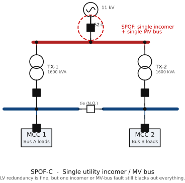

# SPOF Example C — Single Utility Incomer / Single MV Breaker

> Module 3 illustration. Tags per `docs/main-electrical-equipment-2MW-process-plant.md`
> and the master SLD `diagrams/sld-master-2MW.md`.

*Figure rendered from `diagrams/src/` (schemdraw, IEC 60617). See [DRAWING-STANDARD.md](../DRAWING-STANDARD.md).*

**What this illustrates:** Although the LV side has two transformers and a
bus-tie, **everything funnels through a single utility feeder and a single MV
incomer breaker `[52-I]` on a single MV bus**. Loss of the utility supply, the
incomer CB, or an MV busbar fault blacks out the whole plant regardless of the
LV redundancy. The SPOF has simply moved upstream to the MV incomer.
