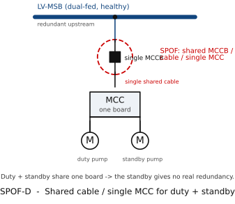

# SPOF Example D — Shared Outgoing Cable / Single MCC for Duty + Standby

> Module 3 illustration. Tags per `docs/main-electrical-equipment-2MW-process-plant.md`
> and the master SLD `diagrams/sld-master-2MW.md`.

*Figure rendered from `diagrams/src/` (schemdraw, IEC 60617). See [DRAWING-STANDARD.md](../DRAWING-STANDARD.md).*

**What this illustrates:** Sources are redundant upstream, but a **single shared
outgoing feeder / single MCC-1** supplies a critical duty pump **and** its
standby pump from the **same bus**. One feeder cable fault, MCC bus fault, or
MCC incomer trip takes **both** the duty and standby pumps offline at once — the
standby provides no protection against the common element. The SPOF is the
shared cable/MCC, not the pumps.
