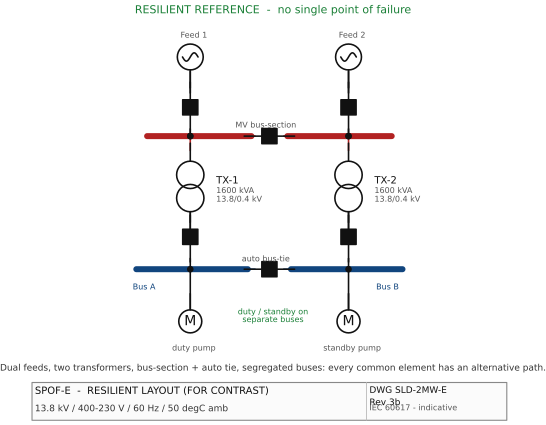

# SPOF Example E — Resilient Reference Layout (for CONTRAST)

> Module 3 illustration. Tags per `docs/main-electrical-equipment-2MW-process-plant.md`
> and the master SLD `diagrams/sld-master-2MW.md`.

*Figure rendered from `diagrams/src/` (schemdraw, IEC 60617). See [DRAWING-STANDARD.md](../DRAWING-STANDARD.md).*

**What this illustrates:** A well-designed, resilient layout shown for contrast.
**Dual independent utility incomers** and a closeable MV bus-section remove the
upstream SPOF; **two full-rated transformers** on **segregated LV buses** with a
**closed/auto bus-tie** (fast transfer) let either source carry the plant after a
single failure. Critical **duty and standby pumps are split across Bus A and Bus
B**, so no single bus, cable, transformer or incomer disables the function — plus
**DG/ATS** for essential loads and **UPS/DCDB** for control. Compare to A–D: each
common element has an alternative path, minimizing single points of failure.
