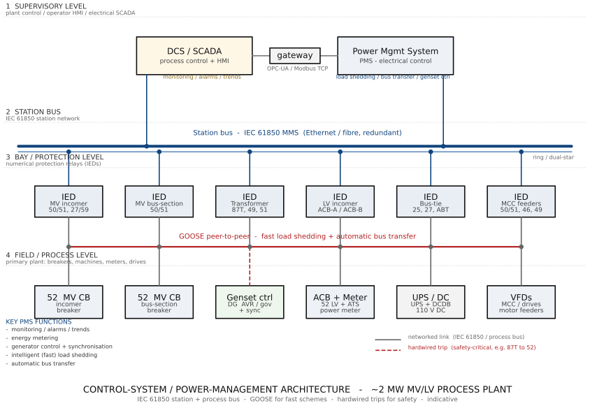

# Module 4 — Control Philosophy & Power Management

*Part of the [MV/LV ~2 MW Process Plant training course](../README.md). Diagram:
[master single-line diagram](../diagrams/sld-master-2MW.md). Basis of design:
[reference design document](../docs/main-electrical-equipment-2MW-process-plant.md).*

> All practices and figures in this module are **indicative and tentative** — they
> illustrate method and typical practice, not a substitute for project-specific
> studies, vendor solutions and the governing standards/grid code.

---

## Introduction

[Module 3](module-03-spof-analysis.md) showed *where* an architecture can fail. This
module covers the **control philosophy** that keeps the plant supplied despite those
failures, and how the electrical system talks to the **DCS and supervisory systems**.
It closes with current best-practice technology and a focus on a fast-growing problem:
**grid voltage instability driven by increasing renewable generation**.

### Learning outcomes

On completion you will be able to:

- State the main **continuity-of-supply philosophies** that avoid service interruption.
- Describe how the electrical system integrates with the **DCS / SCADA / PMS** and the
  role of **IEC 61850** (GOOSE/MMS).
- Identify **best-practice technologies** (digital substation, intelligent load
  shedding, condition monitoring, BESS).
- Explain how **renewable-driven voltage instability** affects the plant and the
  **ride-through and dynamic-support** measures that mitigate it.

---

## 1. Continuity-of-supply philosophies (avoiding service interruption)

The goal is that **no single event interrupts the process** — and that when supply is
disturbed, the plant **recovers automatically and fast**. The layers below combine into
the plant's reliability philosophy (they map directly onto the master SLD).

**1.1 Redundancy & segregation.** The foundation (see Module 3): **N+1** transformers,
a **split LV bus** with a **normally-open bus-tie** ([BT](../diagrams/sld-master-2MW.md#bt)),
segregated buses and dual-fed critical loads, so the loss of one source or board affects
only its zone — not the whole plant.

**1.2 Automatic bus transfer.** On loss of an incomer, the bus-tie **closes automatically**
to back-feed the dead bus from the healthy transformer. Transfer schemes, fastest first:

- **Fast transfer** (< ~100 ms, before the residual motor voltage drifts out of phase) —
  preferred to keep motors spinning and avoid a process trip.
- **In-phase transfer** — closes at the instant the residual and incoming voltages align.
- **Residual-voltage / time-delayed transfer** — waits until residual voltage decays to a
  safe level (slower; risks a process dip).

**1.3 Standby generation & ATS.** On total utility loss, the **[DG](../diagrams/sld-master-2MW.md#dg)**
starts and the **[ATS](../diagrams/sld-master-2MW.md#ats)** transfers the **essential bus**
(EDB); a **black-start** sequence and **load build-up** in priority blocks follows.

**1.4 Load shedding & management.** When generation < demand (utility loss, or running on
one transformer/DG), a **load-shedding** scheme drops **non-essential load** in priority
order on **under-frequency / under-voltage / overload**, keeping the essential process
alive. Modern schemes are **fast and "intelligent"** (see §3).

**1.5 No-break supplies.** The **[UPS](../diagrams/sld-master-2MW.md#ups)** and the
**[DCDB](../diagrams/sld-master-2MW.md#dcdb)** (110 V DC) carry control, protection,
DCS/PLC and critical instrumentation through any transfer with **zero interruption**.

**1.6 Motor re-acceleration & auto-restart.** After a dip or transfer, a sequenced
**re-acceleration** restarts essential motors in groups (avoiding a combined inrush that
would collapse the bus). **VFD flying-restart / kinetic buffering** lets drives ride
through short dips without tripping.

**1.7 Protection that does not over-trip.** Selective, coordinated protection
([Module 2 §10](module-02-calculations.md)) isolates only the faulted zone and avoids
**cascading trips** — the difference between losing a feeder and losing the plant.

---

## 2. Integration with DCS and supervisory systems

The electrical system is not an island: it is monitored and partly controlled from the
plant **DCS** and a dedicated **Power Management System (PMS)**, in a layered architecture.

*Layered control architecture — field IEDs and devices, an IEC 61850 station bus, the PMS,
and the DCS/SCADA supervisory level. Rendered from `diagrams/src/build_control.py`.*

**2.1 The layers.**

| Layer | Role |
|-------|------|
| **DCS / SCADA** | Process control and operator HMI; receives electrical status/alarms, issues high-level commands (e.g. "shed", "start DG"). |
| **Power Management System (PMS)** | The dedicated electrical "brain": load shedding, bus transfer, generator control & synchronisation, source management, energy metering. |
| **Bay / protection IEDs** | Numerical multifunction relays at each breaker (MV incomer, bus-section, transformer 87T, LV incomers, bus-tie, MCC feeders) — protection + measurement + control. |
| **Field / process devices** | Breakers (52), generator controller (AVR/governor + synchroniser), ATS, UPS, power meters, VFDs. |

**2.2 Communications.** A **redundant Ethernet/fibre station bus** carries:

- **IEC 61850 MMS** — reporting, monitoring, settings and commands to the PMS/SCADA.
- **IEC 61850 GOOSE** — fast peer-to-peer messaging **between IEDs** (sub-10 ms) for
  **fast load shedding**, **automatic bus transfer** and interlocks.
- **Modbus TCP / OPC-UA / DNP3** — typical gateways to the DCS and third-party devices;
  **PROFIBUS/PROFINET** to VFDs and motor starters.

**2.3 Hardwired vs networked.** Safety-critical and "last-line" signals (e.g. master trips,
emergency stop, key interlocks) are **hardwired** for determinism and independence;
monitoring, non-critical control, metering and trending ride the **network**. A robust
philosophy uses **both** — networks for speed/flexibility, hardwiring for fail-safe.

**2.4 Functions delivered.** Real-time single-line mimic, alarms and event/SOE records,
trends and historian, energy and power-quality metering, generator dispatch and
synchronisation, automatic source transfer and load shedding, and remote (supervised)
switching.

---

## 3. Best practices using the latest technologies

- **Digital substation (IEC 61850 process bus).** Merging units and sampled values (SV)
  replace copper from CTs/VTs with fibre; fewer wires, self-supervised, easier extension.
- **Intelligent / fast load shedding.** A model-/PLC-based scheme using **GOOSE** sheds
  exactly the right load in **tens of milliseconds** on an event (far faster and more
  precise than traditional under-frequency-only shedding).
- **Arc-flash light+current detection** for **fast tripping** (cuts incident energy —
  [Module 2 §11](module-02-calculations.md)); **zone-selective interlocking (ZSI)** keeps
  selectivity while clearing bus faults quickly.
- **Condition monitoring & predictive maintenance.** Online temperature, **partial-discharge**,
  breaker-health and transformer monitoring; IoT sensors feeding analytics / a **digital
  twin** to move from time-based to condition-based maintenance (reduces the unplanned
  outages that cause SPOF events).
- **Battery Energy Storage System (BESS) / grid-forming inverters.** Provide **ride-through**,
  peak shaving, **inertia emulation** and fast frequency/voltage response; enable seamless
  **islanding** and reconnection (microgrid controller).
- **Power-quality monitoring** (IEC 61000) integrated into the PMS — sags/swells, harmonics,
  flicker — for trending and compliance.
- **Cybersecurity by design** (**IEC 62443**, and locally **NCA** requirements): network
  segmentation, secure-by-default IEDs, role-based access, monitoring — essential once the
  electrical system is networked to the DCS.

---

## 4. Focus — grid voltage instability from increasing renewables

As wind/solar displace synchronous generation, the **grid becomes "weaker"**: less
**inertia**, lower short-circuit level, and **more volatile voltage and frequency**
(fast ROCOF, voltage dips/swells, flicker and rising harmonics from inverter-based
sources). An industrial plant on such a grid sees **more frequent disturbances** at its
point of connection.

**4.1 How it hurts the plant.** Voltage dips and short interruptions cause **contactor
drop-out**, **VFD DC-bus under-voltage trips**, **motor stalls/under-voltage trips**, and
**spurious protection operation** — each a process interruption even though no fault
occurred in the plant. Voltage swells and harmonics stress insulation, capacitors and
electronics.

**4.2 Ride-through (don't trip on a transient).**

- **Under-voltage ride-through (UVRT/LVRT):** set time-delayed UV trips so the plant
  **rides through** standard short dips instead of tripping (coordinated with the grid
  code and protection so real faults still clear).
- **Contactor ride-through / latching** (or DC-held coils, time-delay undervoltage relays)
  to prevent mass contactor drop-out on a brief dip.
- **VFD kinetic buffering / flying restart** and DC-bus support to ride through dips and
  reconnect to spinning motors.

**4.3 Dynamic voltage support (hold the voltage up).**

- **STATCOM / SVC** — fast dynamic reactive power for voltage stabilisation and flicker
  control; far faster than switched capacitors.
- **Dynamic Voltage Restorer (DVR)** — series compensation that protects sensitive loads
  from dips/swells.
- **Fast/thyristor-switched PFC and detuned banks** — quicker reactive support than
  contactor-switched [PFC](../diagrams/sld-master-2MW.md#pfc); **avoid resonance** with the
  rising harmonic background.
- **OLTC / AVR coordination** for steady-state voltage regulation.

**4.4 Storage & local stability.**

- **BESS with grid-forming inverters** provides **synthetic inertia**, fast frequency
  response and voltage support, and can **island** the essential plant during severe grid
  events, reconnecting when stable.
- **UPS / flywheel** keeps control and critical loads firm regardless of grid behaviour.

**4.5 See it before it trips you — power-quality monitoring.** Continuous PQ metering
(IEC 61000-4-30) at the intake and on critical buses, integrated into the PMS, lets the
plant **characterise the grid disturbances**, set ride-through margins correctly, and
demonstrate compliance / support claims against the utility.

**Standards & references:** IEC 61850 (substation comms), IEC 61000 (EMC / power quality),
IEC 62443 (cybersecurity), IEC 62933 (energy storage), IEEE 1547 / grid-code LVRT
requirements for connected resources, IEC 60034 / 61800 (motors & drives ride-through).

---

## 5. Self-check

1. Why is a **fast bus transfer** (< 100 ms) preferred over a residual-voltage transfer?
2. Which signals should be **hardwired** rather than sent over the station network, and why?
3. What does **IEC 61850 GOOSE** enable that traditional hardwired/Modbus schemes do poorly?
4. Name three effects of a **short grid voltage dip** on the plant, and one ride-through
   measure for each.

<strong>Answers</strong>

1. It re-energises the dead bus **before the motors' residual voltage drifts out of phase**,
   so motors keep spinning and the process does not trip; a residual transfer waits for the
   voltage to decay and usually causes a dip/stop.
2. **Master trips, emergency stops and key safety interlocks** — they must be deterministic
   and independent of network/IED health (fail-safe), so they are hardwired; monitoring,
   metering and non-critical control use the network.
3. **Fast (sub-10 ms) peer-to-peer messaging between IEDs** for fast load shedding,
   automatic bus transfer and interlocks — with self-supervision — which is too slow or
   not deterministic over polled Modbus and too inflexible/costly fully hardwired.
4. e.g. **contactor drop-out** → contactor ride-through/latching or time-delay UV relay;
   **VFD DC-bus trip** → kinetic buffering / flying restart; **motor under-voltage trip** →
   UVRT time-delay settings (and STATCOM/BESS voltage support upstream).

---

*This module completes the core course (Modules 1–4). Every figure and practice here is
indicative and to be confirmed by detailed study, vendor selection and the governing grid
code.*
